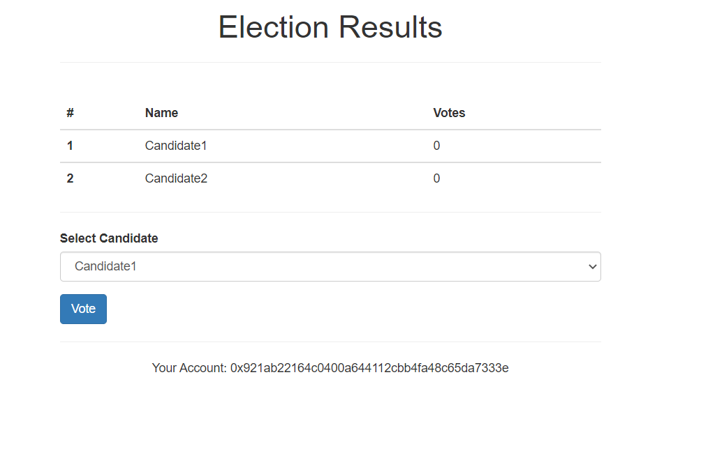

# Vote Election Solidity Candidates
Realtime render

Inicializar Proyecto
## Requerimientos:
Instalar Truffle Globally
### `npm install -g truffle `
Instalar Dependencias
### `npm install`
Abrir Ganache e integrar con Metamask para tests
### `truffle migrate --reset`
Run tests
### `truffle test --show-events`
Abrir proyecto frontend localhost:3000
### `npm run dev`

### Screenshots
